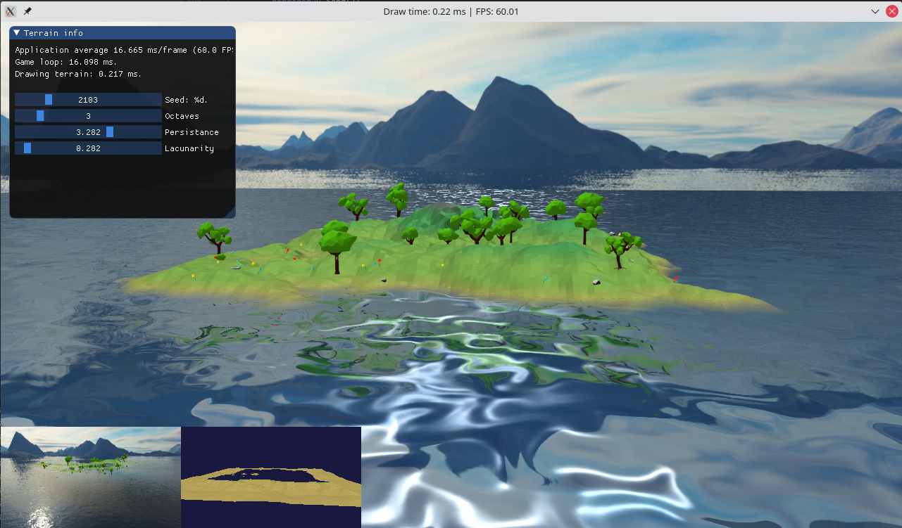
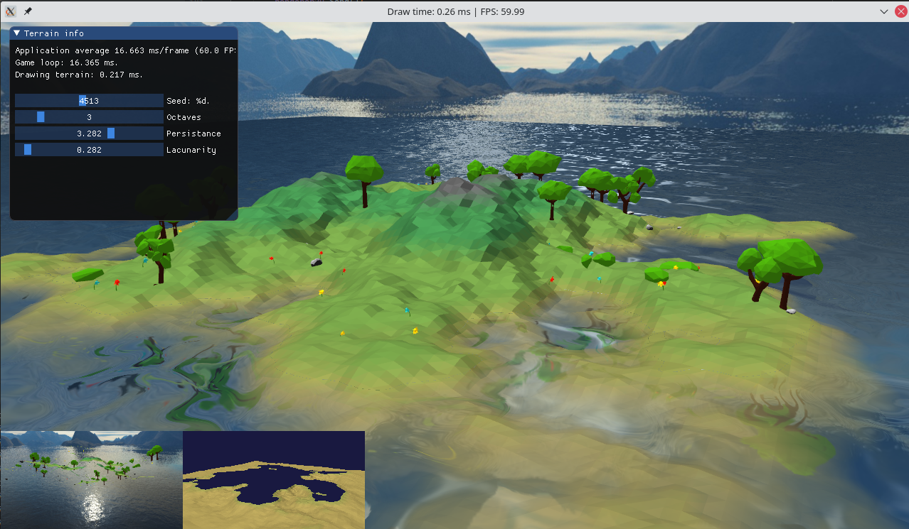

# RG2020
Low-poly procesdually generated terrain and water using C++ and OpenGL.




## Compiling
```
mkdir build && cd build
cmake ../
make
./RG2020
```

## Used librariesknjižnice:
- GLFW (window managment) - https://www.glfw.org/
- glad (OpenGL loader) - https://github.com/go-gl/glfw/blob/master/v3.1/glfw/glfw/deps/glad/glad.h
- stb_image (loading images) - https://github.com/nothings/stb
- Dear_ImGui (simple UI) - https://github.com/ocornut/imgui
- stb_truetype (font rasterizer) - https://github.com/nothings/stb/blob/master/stb_truetype.h
- glm (math computation) - https://glm.g-truc.net/0.9.9/index.html
